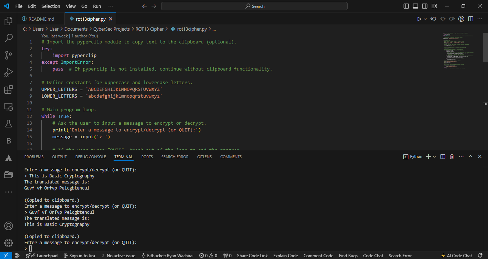

# ROT13 Cipher

## Project Description
This is a Python implementation of the ROT13 cipher, a simple substitution cipher that shifts each letter by 13 places in the alphabet. The program allows users to encrypt and decrypt messages using this method, which is commonly used as a basic form of obfuscation.

## Features
- Encrypts and decrypts text using the ROT13 cipher.
- Handles both uppercase and lowercase letters.
- Leaves non-alphabetic characters unchanged.
- Copies the translated message to the clipboard (if `pyperclip` module is installed).

## Installation
1. Clone the repository:
    git clone https://github.com/Ryan-Wachira/rot13-cipher.git
    
2. Install the required dependencies (if necessary):
    pip install pyperclip
   

## Usage
1. Run the Python script:
    python rot13_cipher.py
    
2. Enter the message you want to encrypt or decrypt. The program will rotate the letters in the message by 13 characters.

3. The translated message will be displayed and copied to the clipboard (if `pyperclip` is installed).

## Example

```
Enter a message to encrypt/decrypt (or QUIT):
> This is Basic Cryptography
The translated message is:
Guvf vf Onfvp Pelcgbtencul

(Copied to clipboard.)
Enter a message to encrypt/decrypt (or QUIT):
> Guvf vf Onfvp Pelcgbtencul
The translated message is:
This is Basic Cryptography
```


